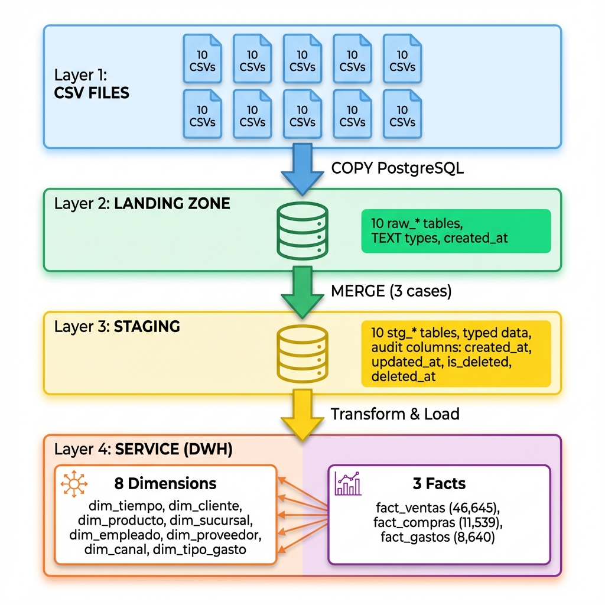

# 🚀 Ejemplo práctico ETL Data Warehousing 

Pipeline end-to-end de ingeniería de datos con arquitectura en 4 capas usando PostgreSQL, implementando MERGE con soft deletes y modelo dimensional (Star Schema).

## 📊 Estado del Proyecto

- 🗄️ **70,837 registros** en Staging
- 📦 **8 dimensiones** cargadas
- 📈 **3 hechos** poblados (66,824 transacciones totales)
- ⚡ **Pipeline automatizado** con orquestador
- 🔄 **Soft deletes** implementados
- 📝 **Auditoría completa** en todas las tablas

---

## 📋 Tabla de Contenidos

- [Arquitectura](#️-arquitectura)
- [Características Principales](#-características-principales)
- [Requisitos](#-requisitos)
- [Instalación](#-instalación)
- [Uso](#-uso)
- [Estructura del Proyecto](#-estructura-del-proyecto)
- [Datos Cargados](#-datos-cargados)
- [Queries de Ejemplo](#-queries-de-ejemplo)

---

## 🏗️ Arquitectura

```
┌──────────────────────────────────────────────────────────┐
│                    CSV FILES (10 archivos)                │
│    Clientes, Ventas, Productos, Compras, Gastos, etc.   │
└───────────────────────┬──────────────────────────────────┘
                        │ COPY de PostgreSQL
                        ↓
┌──────────────────────────────────────────────────────────┐
│         CAPA 1: LANDING ZONE (landing_zone)              │
│  • 10 tablas raw_* con tipos TEXT                        │
│  • Datos crudos sin transformación                        │
│  • Solo columna: created_at                               │
└───────────────────────┬──────────────────────────────────┘
                        │ MERGE (3 casos)
                        ↓
┌──────────────────────────────────────────────────────────┐
│           CAPA 2: STAGING (staging)                      │
│  • 10 tablas stg_* con tipos correctos                   │
│  • MERGE con INSERT, UPDATE, SOFT DELETE                 │
│  • Columnas de auditoría:                                │
│    - created_at, updated_at                              │
│    - is_deleted, deleted_at                              │
└───────────────────────┬──────────────────────────────────┘
                        │ Transformaciones
                        ↓
┌──────────────────────────────────────────────────────────┐
│      CAPA 3: TRANSFORMATION (transformation)             │
│  • Reservada para transformaciones de negocio            │
│  • Normalizaciones adicionales                           │
└───────────────────────┬──────────────────────────────────┘
                        │ MERGE a Star Schema
                        ↓
┌──────────────────────────────────────────────────────────┐
│          CAPA 4: SERVICE / DWH (service)                 │
│  • 8 Dimensiones (SCD Tipo 1)                            │
│    - dim_tiempo, dim_cliente, dim_producto,              │
│      dim_sucursal, dim_empleado, dim_proveedor,          │
│      dim_canal, dim_tipo_gasto                           │
│  • 3 Hechos                                              │
│    - fact_ventas, fact_compras, fact_gastos              │
└──────────────────────────────────────────────────────────┘
```



---

## ✨ Características Principales

### 🔄 MERGE con 3 Casos

Implementado en todos los scripts DML de staging:

```sql
WHEN MATCHED           → UPDATE (actualizar y reactivar)
WHEN NOT MATCHED       → INSERT (nuevos registros)
WHEN NOT MATCHED BY SOURCE → Soft Delete (marcar is_deleted = TRUE)
```

### 📝 Auditoría Completa

Todas las tablas de staging y service incluyen:

- `created_at` - Timestamp de creación
- `updated_at` - Timestamp de última actualización  
- `is_deleted` - Marca de soft delete (boolean)
- `deleted_at` - Fecha de eliminación (NULL si activo)

### ⚡ Pipeline Automatizado

- Orquestador Python que ejecuta todo el flujo
- Logging profesional con timestamps
- Manejo de errores y rollback automático
- Detección automática de delimitadores CSV

### 🔑 Dimensión con Clave Compuesta

`dim_empleado` usa PRIMARY KEY compuesta `(id_empleado, sucursal)` para permitir empleados en múltiples sucursales.

---

## 📦 Requisitos

- **PostgreSQL** 12 o superior
- **Python** 3.8 o superior
- **Dependencias Python**:
  - `psycopg2-binary`
  - `python-dotenv`

---

## 🔧 Instalación

### 1. Instalar dependencias

```bash
pip install -r config/requirements.txt
```

### 2. Crear base de datos

```sql
CREATE DATABASE data_engineering;
```

### 3. Configurar credenciales

Crear archivo `config/.env`:

```env
DB_HOST=localhost
DB_PORT=5432
DB_NAME=data_engineering
DB_USER=postgres
DB_PASSWORD=tu_password
```

### 4. Verificar CSVs

Asegurarse de tener los 10 archivos CSV en `data/`:

- Clientes.csv (3,407 registros)
- Venta.csv (46,645 registros)
- Productos.csv (291 registros)
- Compra.csv (11,539 registros)
- Gasto.csv (8,640 registros)
- Empleados.csv (267 registros)
- Sucursales.csv (31 registros)
- Proveedores.csv (14 registros)
- CanalDeVenta.csv (3 registros)
- TiposDeGasto.csv (4 registros)

---

## 🚀 Uso

### Ejecución Completa (Primera vez)

```bash
python python\orchestration\run_pipeline.py --create-schema --create-tables
```

**Esto ejecuta**:
1. ✅ Crea 4 schemas
2. ✅ Crea 10 tablas en landing_zone
3. ✅ Crea 10 tablas en staging
4. ✅ Crea 8 dimensiones + 3 hechos en service
5. ✅ Puebla dim_tiempo con 4,018 fechas (2015-2025)
6. ✅ Carga 10 CSVs a landing zone
7. ✅ Ejecuta 10 MERGEs staging
8. ✅ Ejecuta 7 MERGEs dimensiones  
9. ✅ Ejecuta 3 MERGEs hechos

**Tiempo de ejecución**: ~5-7 segundos

### Ejecución Incremental

```bash
python python\orchestration\run_pipeline.py
```

Solo ejecuta los pasos de carga (sin recrear tablas).

---

## 📁 Estructura del Proyecto

```
postgres-dwh-layered-architecture/
├── data/                          # Archivos
│
├── sql/                           
│   ├── 00_schemas/
│   │   └── create_schemas.sql
│   ├── 01_landing/ddl/
│   │   └── create_tables.sql
│   ├── 02_staging/
│   │   ├── ddl/create_tables.sql
│   │   └── dml/                   # 10 scripts MERGE
│   └── 04_service/
│       ├── ddl/
│       │   ├── create_dimensions.sql
│       │   └── create_facts.sql
│       └── dml/                   
│
├── python/                       
│   ├── config/
│   │   ├── database.py           
│   │   └── settings.py           
│   ├── ingestion/
│   │   └── csv_to_landing.py     
│   ├── etl/
│   │   └── landing_to_staging.py 
│   ├── orchestration/
│   │   └── run_pipeline.py      # Orquestador principal
│   └── utils/
│       ├── db_utils.py           
│       └── logger.py             
│
├── config/
│   ├── .env                      # Variables de entorno
│   ├── .env.example
│   └── requirements.txt
│
├── logs/                          # Logs de ejecución
├── .gitignore
└── README.md
```

---

## 📊 Datos Cargados

### Capa Staging (70,837 registros)

| Tabla | Registros Activos |
|-------|-------------------|
| stg_clientes | 3,407 |
| stg_ventas | 46,645 |
| stg_productos | 291 |
| stg_compras | 11,539 |
| stg_gastos | 8,640 |
| stg_empleados | 267 |
| stg_sucursales | 31 |
| stg_proveedores | 14 |
| stg_canal_venta | 3 |
| stg_tipo_gasto | 4 |

### Data Warehouse - Service

**Dimensiones**:
- dim_tiempo: 4,018 fechas (2015-2025)
- dim_cliente: 3,407
- dim_producto: 291
- dim_sucursal: 31
- dim_empleado: 267 (clave compuesta)
- dim_proveedor: 14
- dim_canal: 3
- dim_tipo_gasto: 4

**Hechos**:
- fact_ventas: 46,645 transacciones
- fact_compras: 11,539 transacciones
- fact_gastos: 8,640 transacciones

---

## 🔍 Queries de Ejemplo

### Top 10 Productos más vendidos

```sql
SELECT 
    p.producto,
    SUM(fv.cantidad) AS total_vendido,
    SUM(fv.monto_total) AS ingresos_totales
FROM service.fact_ventas fv
JOIN service.dim_producto p ON fv.sk_producto = p.sk_producto
GROUP BY p.producto
ORDER BY ingresos_totales DESC
LIMIT 10;
```

### Ventas por Mes

```sql
SELECT 
    t.anio,
    t.mes_nombre,
    COUNT(*) AS cantidad_ventas,
    SUM(fv.monto_total) AS monto_total
FROM service.fact_ventas fv
JOIN service.dim_tiempo t ON fv.sk_tiempo_venta = t.sk_tiempo
GROUP BY t.anio, t.mes, t.mes_nombre
ORDER BY t.anio, t.mes;
```

### Verificar Soft Deletes

```sql
SELECT 
    'Activos' AS estado,
    COUNT(*) AS cantidad
FROM staging.stg_clientes
WHERE is_deleted = FALSE
UNION ALL
SELECT 
    'Eliminados' AS estado,
    COUNT(*) AS cantidad
FROM staging.stg_clientes
WHERE is_deleted = TRUE;
```

---

## 🧪 Probar Soft Deletes

1. Ejecutar pipeline inicial
2. Eliminar algunas filas de `Clientes.csv`
3. Re-ejecutar: `python python\orchestration\run_pipeline.py`
4. Verificar: `SELECT * FROM staging.stg_clientes WHERE is_deleted = TRUE`

Los registros eliminados tendrán:
- `is_deleted = TRUE`
- `deleted_at` con timestamp
- `updated_at` actualizado

---

## 📈 Conectar con BI Tools

El Data Warehouse está listo para conectarse a:

- **Power BI** - Conector PostgreSQL
- **Tableau** - PostgreSQL driver
- **Metabase** - Open source
- **Apache Superset** - Open source
- **Looker** - Cloud BI

**Connection string**:
```
host=localhost port=5432 dbname=data_engineering user=postgres password=***
```

---

## 🛠️ Troubleshooting

### Error: "fe_sendauth: no password supplied"

✅ **Solución**: Verificar que el archivo `config/.env` existe y tiene `DB_PASSWORD=tu_password`

### Error: "column created_at does not exist"

✅ **Solución**: El script de ingesta especifica columnas explícitamente. Verificar que la versión de `csv_to_landing.py` tenga el diccionario `TABLE_COLUMNS`.

### Error: "duplicate key violates unique constraint"

✅ **Solución**: Si es en `dim_empleado`, verificar que la tabla use PRIMARY KEY `(id_empleado, sucursal)` compuesta.

---

## 👥 Autor

**Nachh07**  

---
