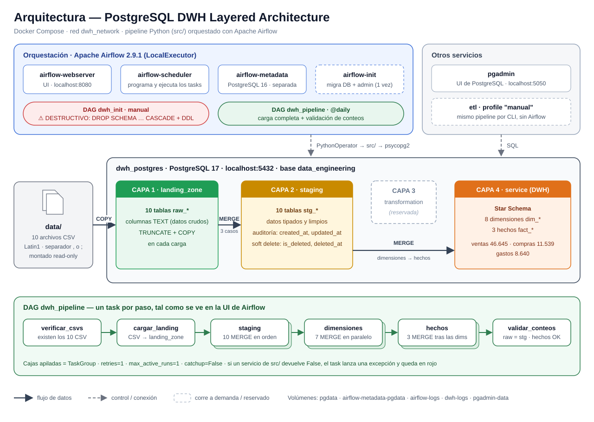
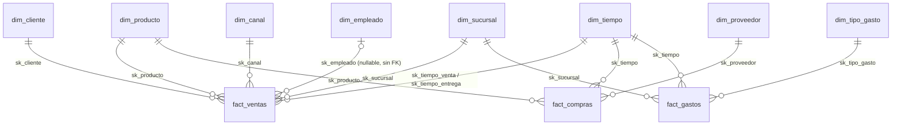
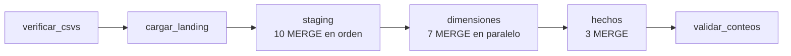

# 🚀 ETL Data Warehousing — PostgreSQL DWH Layered Architecture

Pipeline end-to-end de ingeniería de datos: 10 archivos CSV pasan por una arquitectura de **4 capas en PostgreSQL** hasta un **modelo dimensional (Star Schema)**. Usa MERGE con soft deletes y auditoría completa, está orquestado con **Apache Airflow** y todo corre en **Docker Compose**.




---

## Tabla de contenidos

1. [Qué hace el proyecto](#qué-hace-el-proyecto)
2. [Inicio rápido](#inicio-rápido)
3. [Arquitectura de datos](#arquitectura-de-datos)
4. [Modelo dimensional](#modelo-dimensional)
5. [Orquestación con Airflow](#orquestación-con-airflow)
6. [Servicios de Docker Compose](#servicios-de-docker-compose)
7. [Arquitectura de código](#arquitectura-de-código)
8. [Desarrollo local](#desarrollo-local)
9. [Tests y calidad](#tests-y-calidad)
10. [CI/CD](#cicd)
11. [Estructura del proyecto](#estructura-del-proyecto)
12. [Datos cargados](#datos-cargados)
13. [Queries de ejemplo](#queries-de-ejemplo)
14. [Problemas frecuentes](#problemas-frecuentes)

---

## Qué hace el proyecto

| | |
|---|---|
| 📥 **Ingesta** | 10 CSV → `landing_zone` con `COPY` de PostgreSQL (detecta si el separador es `,` o `;` y lee Latin1) |
| 🔄 **Staging** | `MERGE` con 3 casos (insert / update / soft delete) y columnas de auditoría |
| ⭐ **Data Warehouse** | Star Schema con **8 dimensiones** y **3 hechos** (66.824 transacciones) |
| 🌬️ **Orquestación** | Apache Airflow 2.9.1: un task por paso, dimensiones en paralelo y validación final de conteos |
| 🐳 **Infraestructura** | Docker Compose: DWH, pgAdmin, Airflow y su propia metadata DB |
| 🧪 **Calidad** | 108 tests (84% de cobertura, mínimo 80%) y lint con `ruff` |
| 🤖 **CI/CD** | GitHub Actions: lint + tests + publicación de la imagen en Docker Hub |

---

## Inicio rápido

**Requisito:** Docker Desktop.

```bash
# 1. Variables de entorno (Docker Compose lee el .env de la RAÍZ del repo)
copy config\.env.example .env          # Windows
cp config/.env.example .env            # Linux / macOS
# Completar DB_PASSWORD y las variables AIRFLOW_* (ver "Variables de entorno")

# 2. Levantar todo
docker compose up --build -d

# 3. Esperar a que Airflow esté "healthy"
docker compose ps
```

4. Abrir **http://localhost:8080** (usuario `admin` / `admin`).
5. Activar y ejecutar **`dwh_init`**: crea schemas y tablas. ⚠️ **Borra todo el DWH.**
6. Activar y ejecutar **`dwh_pipeline`**: carga los datos y valida los conteos.

| Servicio | URL / conexión | Credenciales (desarrollo) |
|---|---|---|
| Airflow | http://localhost:8080 | `admin` / `admin` |
| pgAdmin | http://localhost:5050 | `admin@admin.com` / `admin` |
| PostgreSQL (DWH) | `localhost:5432`, base `data_engineering` | `postgres` / `DB_PASSWORD` |

> 💡 **Sin Airflow:** el mismo pipeline se puede correr por CLI con el servicio `etl` (ver [Servicios de Docker Compose](#servicios-de-docker-compose)).

---

## Arquitectura de datos

```
 data/*.csv (10)
      │  COPY (TRUNCATE + carga)
      ▼
┌──────────────────────────────┐
│ CAPA 1 · landing_zone        │  10 tablas raw_*   — datos crudos (TEXT)
└──────────────┬───────────────┘
               │  MERGE (3 casos)
               ▼
┌──────────────────────────────┐
│ CAPA 2 · staging             │  10 tablas stg_*   — tipados + auditoría + soft deletes
└──────────────┬───────────────┘
               │  (CAPA 3 · transformation: reservada)
               ▼
┌──────────────────────────────┐
│ CAPA 4 · service (DWH)       │  8 dim_* + 3 fact_* — Star Schema
└──────────────────────────────┘
```

| Capa | Schema | Tablas | Scripts SQL |
|---|---|---|---|
| 1 · Landing | `landing_zone` | 10 `raw_*` | `sql/01_landing/ddl/` |
| 2 · Staging | `staging` | 10 `stg_*` | `sql/02_staging/ddl/`, `sql/02_staging/dml/merge_*.sql` |
| 3 · Transformation | `transformation` | — (reservada) | — |
| 4 · Service | `service` | 8 `dim_*` + 3 `fact_*` | `sql/04_service/ddl/`, `sql/04_service/dml/merge_*.sql` |

Los 4 schemas se crean con `sql/00_schemas/create_schemas.sql`.

### MERGE con 3 casos

```sql
WHEN MATCHED                  → UPDATE       (actualiza y reactiva el registro)
WHEN NOT MATCHED              → INSERT       (registros nuevos)
WHEN NOT MATCHED BY SOURCE    → Soft delete  (is_deleted = TRUE, deleted_at = now)
```

### Auditoría

Las tablas de staging y service tienen `created_at` y `updated_at`. Las de staging suman `is_deleted` y `deleted_at` para los soft deletes.

---

## Modelo dimensional


```mermaid
erDiagram
    dim_tiempo      ||--o{ fact_ventas  : "sk_tiempo_venta / sk_tiempo_entrega"
    dim_cliente     ||--o{ fact_ventas  : sk_cliente
    dim_producto    ||--o{ fact_ventas  : sk_producto
    dim_sucursal    ||--o{ fact_ventas  : sk_sucursal
    dim_canal       ||--o{ fact_ventas  : sk_canal
    dim_empleado    |o--o{ fact_ventas  : "sk_empleado (nullable, sin FK)"
    dim_producto    ||--o{ fact_compras : sk_producto
    dim_proveedor   ||--o{ fact_compras : sk_proveedor
    dim_tiempo      ||--o{ fact_compras : sk_tiempo
    dim_sucursal    ||--o{ fact_gastos  : sk_sucursal
    dim_tipo_gasto  ||--o{ fact_gastos  : sk_tipo_gasto
    dim_tiempo      ||--o{ fact_gastos  : sk_tiempo
```

| Hecho | Registros | Dimensiones |
|---|---:|---|
| `fact_ventas` | 46.645 | tiempo (venta y entrega), cliente, producto, sucursal, canal, empleado |
| `fact_compras` | 11.539 | tiempo, producto, proveedor |
| `fact_gastos` | 8.640 | tiempo, sucursal, tipo de gasto |

- `dim_tiempo` se genera con `populate_dim_tiempo.sql` durante la inicialización (4.018 días); no viene de un CSV.
- `dim_empleado` tiene clave compuesta `(id_empleado, sucursal)`, porque un empleado puede estar en varias sucursales. Por eso `fact_ventas.sk_empleado` es nullable y no tiene FK.

---

## Orquestación con Airflow

Apache Airflow **2.9.1** (LocalExecutor) orquesta el pipeline de `src/` **sin cambiar su lógica**. Cada paso es un `PythonOperator` y se ve por separado en la UI.

### Los dos DAGs

| DAG | Schedule | Qué hace |
|---|---|---|
| **`dwh_init`** ⚠️ | manual (`schedule=None`) | **DESTRUCTIVO**: `DROP SCHEMA … CASCADE` de los 4 schemas, DDL de todas las tablas y carga de `dim_tiempo`. Equivale a `--create-schema --create-tables --only-init`. |
| **`dwh_pipeline`** | `@daily` | CSV → landing → staging → DWH, más la validación de conteos. `catchup=False`, `max_active_runs=1`, `retries=1`. |

**Orden en una base nueva:** primero `dwh_init`, después `dwh_pipeline`.

### Flujo de `dwh_pipeline`


```mermaid
flowchart LR
    V[verificar_csvs] --> L[cargar_landing]
    L --> S["staging<br/>10 MERGE en orden"]
    S --> D["dimensiones<br/>7 MERGE en paralelo"]
    D --> H["hechos<br/>3 MERGE"]
    H --> C[validar_conteos]
```

| Paso | Tasks | Detalle |
|---|---|---|
| `verificar_csvs` | 1 | Falla si falta alguno de los CSV de `Settings.csv_table_mapping` y dice cuáles faltan |
| `cargar_landing` | 1 | `IngestionService.load_all(truncate=True)` |
| `staging` (TaskGroup) | 10 | `canal_venta → tipo_gasto → sucursales → proveedores → productos → clientes → empleados → ventas → compras → gastos` |
| `dimensiones` (TaskGroup) | 7 | `dim_cliente`, `dim_producto`, `dim_sucursal`, `dim_empleado`, `dim_proveedor`, `dim_canal`, `dim_tipo_gasto` (en paralelo) |
| `hechos` (TaskGroup) | 3 | `fact_ventas → fact_compras → fact_gastos`, cuando terminaron **todas** las dimensiones |
| `validar_conteos` | 1 | `raw_ventas` = `stg_ventas` activas, y cada hecho igual al valor esperado |

- Los scripts y su orden salen de las constantes de `staging_service.py` y `service_layer_service.py` (`STAGING_MERGE_SCRIPTS`, `DIMENSION_MERGE_SCRIPTS`, `FACT_MERGE_SCRIPTS`). Si se agrega un script ahí, aparece solo como un task nuevo.
- Los conteos esperados se configuran en un único lugar: `EXPECTED_FACT_COUNTS`, en `dags/dwh_common/config.py`.

### Semántica de errores

Los servicios de `src/` **no lanzan excepciones**: loguean el error y devuelven `False`. Airflow, en cambio, solo marca un task en rojo si hay una excepción. Por eso cada callable de `dags/dwh_common/tasks.py` convierte un `False` en `PipelineStepError`. Las cargas son idempotentes (TRUNCATE + MERGE), así que reintentar es seguro.

### Cómo ejecutarlo

Desde la UI: activar el DAG (toggle) y ▶ **Trigger DAG**. Los DAGs se crean pausados. Al activar `dwh_pipeline`, Airflow también lanza sola la corrida del último día (`catchup=False`).

Por CLI:

```bash
docker exec dwh_airflow_scheduler airflow dags list-import-errors     # debe decir "No data found"
docker exec dwh_airflow_scheduler airflow dags unpause dwh_init
docker exec dwh_airflow_scheduler airflow dags trigger dwh_init
docker exec dwh_airflow_scheduler airflow dags unpause dwh_pipeline
docker exec dwh_airflow_scheduler airflow dags trigger dwh_pipeline
docker exec dwh_airflow_scheduler airflow tasks list dwh_pipeline --tree
```

### ¿Hay que recrear los contenedores después de un cambio?

| Cambio | Qué hacer |
|---|---|
| Código en `dags/`, `src/` o `sql/` | Nada: están montados como volúmenes y el scheduler relee los DAGs cada ~30 s |
| Un archivo de DAG **nuevo** | Nada (tarda hasta 5 min en aparecer), o `docker exec dwh_airflow_scheduler airflow dags reserialize` |
| `docker-compose.yml` o `.env` | `docker compose up -d` |
| `docker/airflow/Dockerfile` o `docker/airflow/requirements.txt` | `docker compose up -d --build` |

### Variables de entorno

Todas están en `config/.env.example`. Copiarlo al `.env` de la raíz y completar:

| Variable | Uso |
|---|---|
| `DB_HOST`, `DB_PORT`, `DB_NAME`, `DB_USER`, `DB_PASSWORD` | Conexión al DWH. En Docker, `DB_HOST` se fuerza a `postgres`. Llegan a Airflow como variables de entorno (no se usan Connections). |
| `AIRFLOW_ADMIN_USER`, `AIRFLOW_ADMIN_PASSWORD` | Usuario de la UI de Airflow |
| `AIRFLOW_METADATA_PASSWORD` | Password de la metadata DB de Airflow |
| `AIRFLOW_FERNET_KEY` | Cifra Connections y Variables en la metadata DB |
| `AIRFLOW_WEBSERVER_SECRET_KEY` | Clave de sesión del webserver |

Generar la Fernet key:

```bash
docker run --rm apache/airflow:2.9.1-python3.11 python -c "from cryptography.fernet import Fernet; print(Fernet.generate_key().decode())"
```

### Detalles de la integración

- **Imagen:** `docker/airflow/Dockerfile` usa `apache/airflow:2.9.1-python3.11` e instala `docker/airflow/requirements.txt` con el *constraints file* oficial. Airflow **no** está en `config/requirements.txt` porque ese archivo lo usan el ETL y el CI.
- **Rutas:** la raíz del proyecto dentro del contenedor es `/opt/dwh` (`PYTHONPATH=/opt/dwh`). `src/`, `sql/` y `data/` están montados como solo lectura, y `/opt/dwh/logs` es un volumen escribible, porque `Settings` crea `logs/` al importarse.
- **Metadata DB:** el contenedor `airflow-metadata` (PostgreSQL 16) está separado del DWH, así que el `DROP SCHEMA` de `dwh_init` no la afecta.
- **Logs:** los mensajes de `src/` aparecen dentro del log de cada task en la UI.
- **Zona horaria:** America/Argentina/Buenos_Aires.

---

## Servicios de Docker Compose

| Servicio | Imagen | Puerto | Rol |
|---|---|---|---|
| `postgres` | `postgres:17-alpine` | 5432 | Data Warehouse (base `data_engineering`) |
| `pgadmin` | `dpage/pgadmin4` | 5050 | UI web para PostgreSQL |
| `airflow-metadata` | `postgres:16-alpine` | — | Metadata DB de Airflow |
| `airflow-init` | `dwh-airflow:2.9.1` | — | Migra la metadata DB y crea el usuario admin; corre una vez y termina |
| `airflow-webserver` | `dwh-airflow:2.9.1` | 8080 | UI de Airflow |
| `airflow-scheduler` | `dwh-airflow:2.9.1` | — | Programa y ejecuta los tasks (LocalExecutor) |
| `etl` | build del `Dockerfile` raíz | — | Pipeline por CLI, **sin Airflow**. Profile `manual`: `docker compose up` no lo inicia |

```bash
# Pipeline completo sin Airflow
docker compose run --rm etl python -m src.domain.pipeline.pipeline_orchestrator

# ⚠️ Recrear schemas y tablas (DESTRUCTIVO) sin cargar datos
docker compose run --rm etl python -m src.domain.pipeline.pipeline_orchestrator --create-schema --create-tables --only-init

# Solo la base de datos (para DBeaver, pgAdmin o Power BI)
docker compose up -d postgres

# Apagar (conserva los datos)
docker compose down

# Apagar y BORRAR todos los volúmenes (DWH, historial de Airflow, logs)
docker compose down -v
```

**Volúmenes:** `pgdata` (DWH), `airflow-metadata-pgdata`, `airflow-logs`, `dwh-logs` y `pgadmin-data`.

---

## Arquitectura de código

El código Python está en `src/`, organizado en 3 capas:

```
src/
├── shared/                         ← Configuración y logger (no depende de nada)
│   ├── config/
│   │   ├── settings.py             ← Settings (frozen dataclass): rutas, mapeo CSV → tabla
│   │   └── database_settings.py    ← DatabaseSettings: lee DB_* de config/.env o del entorno
│   └── logger.py
│
├── infrastructure/                 ← I/O: base de datos y archivos SQL
│   ├── database/
│   │   └── connection.py           ← DatabaseConnection (psycopg2 con context managers)
│   └── repositories/
│       └── sql_repository.py       ← SQLRepository (execute_file, truncate, count)
│
└── domain/                         ← Lógica del pipeline
    ├── models/
    │   └── pipeline_result.py      ← StepResult, PipelineResult (value objects)
    ├── services/
    │   ├── ingestion_service.py    ← CSV → Landing Zone
    │   ├── staging_service.py      ← Landing → Staging (MERGE)
    │   └── service_layer_service.py← Staging → DWH (MERGE dims + hechos)
    └── pipeline/
        └── pipeline_orchestrator.py← Orquestador end-to-end + CLI
```

Los DAGs de Airflow (`dags/`) solo **llaman** a estas clases; no duplican lógica.

**Principios de diseño**

- **Inyección de dependencias:** cada clase recibe sus dependencias por constructor, lo que facilita los mocks en los tests.
- **Dependencias en un solo sentido:** `domain → infrastructure → shared`.
- **Inmutabilidad:** `Settings` y `DatabaseSettings` son `frozen=True`.
- **Fail-fast:** el orquestador se detiene ante el primer error (exit code 1).

---

## Desarrollo local

Requisitos: Python 3.11+ y un PostgreSQL accesible (por ejemplo, `docker compose up -d postgres`).

```bash
# 1. Dependencias
pip install -r config/requirements.txt

# 2. Credenciales
copy config\.env.example config\.env      # Windows
cp config/.env.example config/.env        # Linux / macOS

# 3. Primera vez: schemas + tablas + carga
python -m src.domain.pipeline.pipeline_orchestrator --create-schema --create-tables

# 4. Ejecuciones siguientes
python -m src.domain.pipeline.pipeline_orchestrator

# Solo inicializar (DDL), sin cargar datos
python -m src.domain.pipeline.pipeline_orchestrator --create-schema --create-tables --only-init
```

---

## Tests y calidad

```bash
python -m pytest                                          # todos, con reporte de cobertura (mínimo 80%)
python -m pytest -m "not integration"                     # sin los tests que necesitan una base real
python -m pytest tests/dags -v                            # estructura de los DAGs
python -m pytest tests/domain/test_ingestion_service.py -v
python -m ruff check .                                    # lint (lo mismo que corre el CI)
start htmlcov/index.html                                  # reporte HTML (Windows)
```

- **Unit tests:** mockean psycopg2, así que no necesitan base de datos.
- **Integration tests** (`-m integration`): necesitan un PostgreSQL levantado.
- **Tests de DAGs** (`tests/dags/`): verifican parámetros, task_ids y dependencias de ambos DAGs **sin instalar Airflow**. Usan versiones mínimas falsas de `DAG`, `PythonOperator`, `TaskGroup` y `chain`. También prueban que cada callable lance una excepción cuando `src/` devuelve `False`.

| Módulo | Cobertura |
|---|---:|
| `infrastructure/database/connection.py` | 100% |
| `infrastructure/repositories/sql_repository.py` | 100% |
| `domain/services/ingestion_service.py` | 100% |
| `domain/services/staging_service.py` | 100% |
| `shared/config/settings.py` | 100% |
| `shared/logger.py` | 95% |
| `shared/config/database_settings.py` | 92% |
| `domain/pipeline/pipeline_orchestrator.py` | 90% |
| `domain/services/service_layer_service.py` | 33% |
| `domain/models/pipeline_result.py` | 0% |
| **Total** | **84%** |

**Ruff:** `line-length = 100`, reglas `E, W, F, I, B, UP`.

---

## CI/CD

Workflow de GitHub Actions: `.github/workflows/main_pipeline.yml`.

1. **Lint:** `ruff check .` en cada push o PR a `main` / `develop`.
2. **Tests:** unit tests con cobertura mínima del 80%, más tests de integración contra un servicio `postgres:17-alpine`.
3. **Docker:** en cada push a `main`, si los tests pasan, se construye la imagen multi-stage (`builder` → `runtime`) y se publica en **Docker Hub**.

---

## Estructura del proyecto

```
postgres-dwh-layered-architecture/
│
├── src/                          ← Pipeline Python (shared / infrastructure / domain)
├── dags/                         ← DAGs de Airflow
│   ├── dwh_init.py               ← ⚠️ Init destructivo (manual)
│   ├── dwh_pipeline.py           ← Pipeline diario
│   ├── .airflowignore            ← Excluye dwh_common/ del parseo de DAGs
│   └── dwh_common/               ← Callables + config (no importa Airflow)
│       ├── tasks.py
│       └── config.py
│
├── sql/                          ← Scripts SQL (DDL + DML MERGE)
│   ├── 00_schemas/
│   ├── 01_landing/
│   ├── 02_staging/
│   └── 04_service/
│
├── tests/                        ← pytest
│   ├── conftest.py               ← Fixtures compartidas (mocks)
│   ├── shared/
│   ├── infrastructure/
│   ├── domain/
│   └── dags/                     ← Tests de DAGs sin Airflow
│
├── data/                         ← CSVs fuente (10 archivos)
├── docker/
│   ├── init-db/01_init.sql       ← Init de PostgreSQL (primer arranque)
│   └── airflow/                  ← Imagen de Airflow (Dockerfile + requirements.txt)
├── docs/
│   ├── architecture_diagram.svg  ← Diagrama de arquitectura (fuente)
│   └── architecture_diagram.png  ← Mismo diagrama en PNG
│
├── config/
│   ├── .env.example              ← Plantilla de variables (DWH + Airflow)
│   └── requirements.txt          ← Dependencias del ETL y del CI (sin Airflow)
│
├── Dockerfile                    ← Imagen del ETL (multi-stage)
├── docker-compose.yml            ← postgres + pgadmin + Airflow (+ etl manual)
├── pyproject.toml                ← pytest, coverage y ruff
└── README.md
```

---

## Datos cargados

| Staging | Registros | | Service | Registros |
|---|---:|---|---|---:|
| `stg_ventas` | 46.645 | | `fact_ventas` | 46.645 |
| `stg_compras` | 11.539 | | `fact_compras` | 11.539 |
| `stg_gastos` | 8.640 | | `fact_gastos` | 8.640 |
| `stg_clientes` | 3.407 | | `dim_tiempo` | 4.018 |
| `stg_productos` | 291 | | `dim_cliente` | 3.407 |
| `stg_empleados` | 267 | | `dim_producto` | 291 |
| `stg_sucursales` | 31 | | `dim_empleado` | 267 |
| `stg_proveedores` | 14 | | `dim_sucursal` | 31 |
| `stg_tipo_gasto` | 4 | | `dim_proveedor` | 14 |
| `stg_canal_venta` | 3 | | `dim_tipo_gasto` | 4 |
| **Total** | **70.841** | | `dim_canal` | 3 |

---

## Queries de ejemplo

**Top 10 productos por ingresos**

```sql
SELECT p.producto, SUM(fv.cantidad) AS total_vendido, SUM(fv.monto_total) AS ingresos_totales
FROM service.fact_ventas fv
JOIN service.dim_producto p ON fv.sk_producto = p.sk_producto
GROUP BY p.producto
ORDER BY ingresos_totales DESC
LIMIT 10;
```

**Ventas por mes**

```sql
SELECT t.anio, t.mes_nombre, COUNT(*) AS cantidad_ventas, SUM(fv.monto_total) AS monto_total
FROM service.fact_ventas fv
JOIN service.dim_tiempo t ON fv.sk_tiempo_venta = t.sk_tiempo
GROUP BY t.anio, t.mes, t.mes_nombre
ORDER BY t.anio, t.mes;
```

---

## Problemas frecuentes

| Síntoma | Causa / solución |
|---|---|
| `dwh_pipeline` falla en `cargar_landing` con "relation does not exist" | Todavía no se ejecutó `dwh_init`: correrlo primero |
| `verificar_csvs` falla con `Faltan N CSV en /opt/dwh/data: …` | Falta algún archivo en `data/`; el mensaje dice cuál |
| `validar_conteos` falla | Cambiaron los CSV: actualizar `EXPECTED_FACT_COUNTS` en `dags/dwh_common/config.py` |
| `[WARN] No se encontró .env en: /opt/dwh/config/.env` en los logs | Esperable: en Docker las credenciales llegan como variables de entorno |
| El puerto 5432, 5050 u 8080 ya está en uso | Detener el otro servicio o cambiar el mapeo de puertos en `docker-compose.yml` |
| Se borró el historial de Airflow | `docker compose down -v` borra todos los volúmenes; usar `docker compose down` sin `-v` |

---

## Autor

**Nachh07** — Data Engineering Team
Educación IT · Curso de Data Engineering
